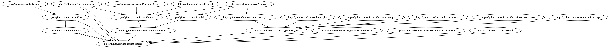

# IoT Core NXP BSP Repository Support Notice

This repository is no longer supported and is now read-only. The BSP and documentation for the iMX6, iMX7 and iMX8 processors for Windows 10 IoT is now published by NXP [here](https://www.nxp.com/design/software/embedded-software/windows-10-iot-core-for-i.mx-applications-processors:IMXWIN10IOT). Support for the BSP is available in NXP's [community forums](https://community.nxp.com/community/imx/content?filterID=contentstatus%5Bpublished%5D%7Ecategory%5Bwindows%5D).

The following repositories have been archived and made read-only on GitHub. If you have a fork of any of these repositories they will remain active, but no new updates will be supplied by Microsoft. Development has stopped in these repositories and all future work will be released by NXP in their BSP.

The repositories to be archived are:
https://github.com/ms-iot/imx-iotcore
https://github.com/ms-iot/u-boot
https://github.com/ms-iot/edk2
https://github.com/ms-iot/imx-edk2-platforms
https://github.com/ms-iot/mu_platform_nxp
https://github.com/ms-iot/mu_silicon_nxp

The NXP BSP only has board support for NXP EVK and Sabre devices. For other previously supported devices, contact the manufacturer for further support.

All compiled firmware binaries in this repository have been removed. The sources in this repository can still be built, but to generate a bootable image, the boot loaders and firmware must be manually built first according to the instructions in the Building Firmware from Source section later in this document.

# Windows 10 IoT Core for NXP i.MX Processors

**Important! Please read this section first.**

**This code is provided as a public preview, it is still under development which means not all platform features are enabled or fully optimized. Notwithstanding the license attached to this code, should not be used in any commercial application at this time. For any questions and feedback on how the BSP can better support your targeted solution, please contact your Microsoft or NXP representative or post to the [NXP community](https://community.nxp.com/community/imx).**

**This code is available under the [MIT](LICENSE) license except where stated otherwise such as the imxnetmini driver and OpteeClientLib.**

## Board List

| SoC Type | Board Vendor | Board Name | Board Package Name|
|-----|-----|-----|-----|
|i.MX 6Quad | SolidRun | HummingBoard Edge | HummingBoardEdge_iMX6Q_2GB |
|i.MX 6Quad | NXP | i.MX 6Quad SABRE | Sabre_iMX6Q_1GB |
|i.MX 6Quad | Boundry Devices | i.MX 6Quad SABRELITE | SabreLite_iMX6Q_1GB |
|i.MX 6Quad | VIA | VAB-820 | VAB820_iMX6Q_1GB |
|i.MX 6QuadPlus | NXP | i.MX 6QuadPlus SABRE | Sabre_iMX6QP_1GB |
|i.MX 6DualLite | SolidRun | HummingBoard Edge | HummingBoardEdge_iMX6DL_1GB |
|i.MX 6Solo | SolidRun | HummingBoard Edge | HummingBoardEdge_iMX6S_512MB |
|i.MX 6SoloX | UDOO | Neo Full | UdooNeo_iMX6SX_1GB |
|i.MX 6SoloX | NXP | i.MX SX Sabre | Sabre_iMX6SX_1GB |
|i.MX 6ULL | NXP | i.MX 6ULL EVK | EVK_iMX6ULL_512MB |
|i.MX 7Dual | CompuLab | IoT Gateway, CL-SOM-iMX7+SBC-iMX7 | ClSomImx7_iMX7D_1GB |
|i.MX 7Dual | NXP | i.MX 7Dual SABRE | Sabre_iMX7D_1GB |
|i.MX 8M | NXP | i.MX 8M EVK | NXPEVK_IMX8M_4GB |
|i.MX 8M Mini | NXP | i.MX 8M Mini EVK | NXPEVK_IMX8M_Mini_2GB |

A table of the currently enabled features for each board can be found [here](Documentation/board-feature-list.md). For hardware issues, please contact the hardware vendor.

## Building the BSP

### Cloning the Repository
This repository uses submodules and should be cloned with `git clone --recurse-submodules`

### Required Tools
The following tools are required to build the driver packages and IoT Core FFU: Visual Studio 2017, Windows Kits (ADK/SDK/WDK), and the IoT Core OS Packages.

#### Visual Studio 2017
* Make sure that you **install Visual Studio 2017 before the WDK** so that the WDK can install a required plugin.
* Download [Visual Studio 2017](https://docs.microsoft.com/en-us/windows-hardware/drivers/other-wdk-downloads#step-1-install-visual-studio).
* During install select **Desktop development with C++**.
* During install select the following in the Individual components tab. If these options are not available try updating VS2017 to the latest release:
  * **VC++ 2017 version 15.9 v14.16 Libs for Spectre (ARM)**
  * **VC++ 2017 version 15.9 v14.16 Libs for Spectre (ARM64)**
  * **VC++ 2017 version 15.9 v14.16 Libs for Spectre (X86 and x64)**
  * **Visual C++ compilers and libraries for ARM**
  * **Visual C++ compilers and libraries for ARM64**

#### Windows Kits from Windows 10, version 1809
* **IMPORTANT: Make sure that any previous versions of the ADK and WDK have been uninstalled!**
* Install [ADK version 1809](https://docs.microsoft.com/en-us/windows-hardware/get-started/adk-install#other-adk-downloads)
* Install [WDK version 1809](https://docs.microsoft.com/en-us/windows-hardware/drivers/other-wdk-downloads#step-2-install-the-wdk)
  * Make sure that you allow the Visual Studio Extension to install after the WDK install completes.
* If the WDK installer says it could not find the correct SDK version, install [SDK version 1809](https://developer.microsoft.com/en-us/windows/downloads/sdk-archive)

#### IoT Core OS Packages
* Visit the [Windows IoT Core Downloads](https://www.microsoft.com/en-us/software-download/windows10IoTCore#!) page and download "Windows 10 IoT Core Packages – Windows 10 IoT Core, version 1809 (LTSC)".
* Open the iso and install ```Windows_10_IoT_Core_ARM_Packages.msi```
* Install ```Windows_10_IoT_Core_ARM64_Packages.msi``` for ARM64 builds.

### One-Time Environment Setup
Test certificates must be installed to generate driver packages on a development machine.
1. Open an Administrator Command Prompt.
2. Navigate to your newly cloned repo and into the folder `imx-iotcore\build\tools`.
3. Launch `StartBuildEnv.bat`.
4. Run `SetupCertificate.bat` to install the test certificates.
5. Make sure that submodules have been cloned. If you cloned with `--recurse-submodules` then this step won't output anything.
    ```
    git submodule init
    git submodule update
    ```

### FFU Generation

1. Launch Visual Studio 2017 as Administrator.
2. Open the solution iMXPlatform.sln (imx-iotcore\build\solution\iMXPlatform).
3. Change the build type from Debug to Release. Change the build flavor from ARM to ARM64 if building for iMX8.
4. To build press Ctrl-Shift-B or choose Build -> Build Solution from menu. This will compile all driver packages then generate the FFU.
5. Depending on the speed of the build machine FFU generation may take around 10-20 minutes.
6. After a successful build the new FFU will be located in `imx-iotcore\build\solution\iMXPlatform\Build\FFU\HummingBoardEdge_iMX6Q_2GB\` for ARM builds and `imx-iotcore\build\solution\iMXPlatform\Build\FFU\NXPEVK_iMX8M_4GB` for ARM64 builds.
7. The FFU contains firmware components for the HummingBoard Edge with the Quad Core SOM or NXP IMX8M EVK with i.MX8M Quad Core SOM depending on build flavor. This firmware is automatically applied to the SD Card during the FFU imaging process.

#### Building the FFU for other boards
In order to build an FFU for another board you'll need to modify GenerateFFU.bat in the Build Scripts folder of the Solution Explorer. Comment out the default HummingBoardEdge_iMX6Q_2GB or NXPEVK_iMX8M_4GB builds with REM and uncomment any other boards you want to build.
```bat
REM cd /d %BATCH_HOME%
REM echo "Building HummingBoardEdge_iMX6Q_2GB FFU"
REM call BuildImage HummingBoardEdge_iMX6Q_2GB HummingBoardEdge_iMX6Q_2GB_TestOEMInput.xml

cd /d %BATCH_HOME%
echo "Building Sabre_iMX6Q_1GB FFU"
call BuildImage Sabre_iMX6Q_1GB Sabre_iMX6Q_1GB_TestOEMInput.xml
```

### Deploy the FFU
 - Follow the instructions in the [IoT Core Manufacturing Guide](https://docs.microsoft.com/en-us/windows-hardware/manufacture/iot/create-a-basic-image#span-idflashanimagespanflash-the-image-to-a-memory-card) to flash the FFU to an SD Card using the Windows IoT Core Dashboard.

### Installing to an eMMC
 - Follow the instructions in the [Booting WinPE and Flashing eMMC](Documentation/winpe-mmc.md) document.

### Adding a New Board
 - Follow the instructions in the [Adding a New Board](Documentation/newboard.md) document.

### Adding a New Driver
 - Follow the instructions in the [Adding a New Driver](Documentation/adding-drivers.md) document.

### Building the FFU with the IoT ADK AddonKit
1. Build the GenerateBSP project to create a BSP folder in the root of the repository.
2. Clone the [IoT ADK AddonKit](https://github.com/ms-iot/iot-adk-addonkit).
3. Follow the [Create a basic image instructions](https://docs.microsoft.com/en-us/windows-hardware/manufacture/iot/create-a-basic-image) from the IoT Core Manufacturing guide with the following changes.
* When importing a BSP use one of the board names from the newly generated BSP folder in the imx-iotcore repo.
    ```
    Import-IoTBSP HummingBoardEdge_iMX6Q_2GB <Path to imx-iotcore\BSP>
    ```
* When creating a product use the same board name from the BSP import.
    ```
    Add-IoTProduct ProductA HummingBoardEdge_iMX6Q_2GB
    ```


# Building Firmware from Source

Building custom firmware into an FFU requires additional steps:

* [Building and Updating Firmware for ARM](Documentation/build-firmware.md)
* [Building and Updating Firmware for ARM64](Documentation/build-arm64-firmware.md)
* [Firmware Boot Documentation](Documentation/boot.md)
* [Firmware Signing Documentation for ARM](Documentation/signing-firmware.md)
* [Testing your BSP](Documentation/tests.md)
* [Creating Windows PE images and booting from eMMC](Documentation/winpe-mmc.md)

The firmware code can be found in the following repos:



* U-Boot: https://github.com/ms-iot/u-boot.git
* OP-TEE: https://github.com/ms-iot/optee_os.git
* UEFI for ARM:
  * https://github.com/tianocore/edk2.git
  * https://github.com/ms-iot/imx-edk2-platforms.git
* UEFI for ARM64:
  * https://github.com/ms-iot/MU_PLATFORM_NXP.git
  * https://github.com/ms-iot/MU_SILICON_NXP.git
  * https://github.com/Microsoft/mu_basecore.git
  * https://github.com/Microsoft/mu_plus.git
  * https://github.com/Microsoft/mu_silicon_arm_tiano.git
  * https://github.com/Microsoft/mu_tiano_plus.git
  * https://github.com/openssl/openssl
* Arm Trusted Firmware for ARM64:
  * https://source.codeaurora.org/external/imx/imx-atf
* IMX MkImage for ARM64:
  * https://source.codeaurora.org/external/imx/imx-mkimage
* Firmware TPM2.0:
  * https://github.com/Microsoft/ms-tpm-20-ref

### Directories

BSP - Generated at build time. Contains Board Support Packages for the [IoT ADK AddonKit](https://github.com/ms-iot/iot-adk-addonkit).

build - Contains Board Packages, build scripts, and the VS2017 solution file.

driver - Contains driver sources.

documentation - Contains usage documentation.

hal - Contains hal extension sources.

## Info

For more information about Windows 10 IoT Core, see our online documentation [here](http://windowsondevices.com)

We are working hard to improve Windows 10 IoT Core and deeply value any feedback we get.

This project has adopted the [Microsoft Open Source Code of Conduct](https://opensource.microsoft.com/codeofconduct/). For more information see the [Code of Conduct FAQ](https://opensource.microsoft.com/codeofconduct/faq/) or contact [opencode@microsoft.com](mailto:opencode@microsoft.com) with any additional questions or comments.


---

## 自用构建产物（NXP i.MX8M Quad EVK / NXPEVK_iMX8M_4GB）

本仓库 public_preview 分支同步自 ms-iot/imx-iotcore（已归档只读）。本分支追加以下**自用**内容（2026-10-02 构建完成，供 Windows 10 IoT Core FFU 打包使用）：

```
imx-iotcore/
├── artifacts/        固件链最终产物（flash.bin / uefi.fit / tee.bin / bl31.bin / TAs）
├── bsp-pkg/          BSP 包：17 个 cab + DeviceFM/FileList + OEMInputSamples
└── scripts/
    ├── wsl/          WSL Debian 侧固件链构建脚本（bash）
    └── tools/        Windows 侧打包脚本（PowerShell，需 ADK 17763）
```

### 快速开始（一次性出结果）

环境要求：

- WSL Debian 13+（以 root 执行；`sudo` 读管道 stdin 会挂死）
- 交叉工具链：Linaro gcc 7.2.1 aarch64（`gcc-linaro-7.2.1-2017.11-x86_64_aarch64-linux-gnu.tar.xz`，解压到 `/opt/fw/toolchain/`）
- 上游源码快照：见下表，各组件解压到 `/opt/fw/<组件>/`
- Windows：ADK 17763（`tools\bin\i386\PkgGen.exe`）+ `build_tools\Tools_17704\bin\i386\makecat.exe`

固件链（WSL，root）：

```bash
wsl -d Debian --user root -- bash scripts/wsl/wsl_build_step.sh imx8_uefi
```

产物输出于 `/opt/fw/imx-mkimage/iMX8M/flash.bin` 与 `/opt/fw/mu_platform_nxp/Build/MCIMX8M_EVK_4GB/RELEASE_GCC5/FV/uefi.fit`。

BSP 打包（Windows，PowerShell）：

```powershell
powershell -ExecutionPolicy Bypass -File scripts\tools\pkg_build.ps1   # 生成缺失 cab
powershell -ExecutionPolicy Bypass -File scripts\tools\verify_fm.ps1   # 核对 FM 引用 17/17
```

### WSL 使用说明

- 调用范式：`wsl -d Debian --user root -- bash <脚本>.sh`；复杂内联命令会被 PowerShell 转义破坏，一律走 .sh 文件。
- 离线源码策略：WSL 内访问 GitHub 超时，全部上游源码由本机下载 **commit 级 zip** 后手动解压归位；`wsl_git_init*.sh` 为无 `.git` 的源码建立 git 骨架并令其“有本地改动”，使 MU 构建自动跳过 fetch。
- 构建工作区约定：全部组件并排在 `/opt/fw/`（u-boot、optee_os、imx-atf、imx-mkimage、mu_platform_nxp、MSRSec、imx-iotcore（仅 build/firmware）、firmware-imx-8.1、optee_examples、toolchain/）。

### 上游源码快照

| 组件 | 快照（zip） | 版本 / commit |
|---|---|---|
| u-boot | u-boot-imx_v2018.03_4.14.98_2.0.0_ga.zip | NXP imx_v2018.03_4.14.98_2.0.0_ga |
| optee_os | optee_os-imx_4.14.98_2.0.0_ga.zip | NXP 4.14.98_2.0.0_ga |
| imx-atf | imx-atf-imx_4.14.98_2.0.0_ga.zip | NXP 4.14.98_2.0.0_ga |
| imx-mkimage | imx-mkimage-imx_4.14.98_2.0.0_ga.zip | NXP 4.14.98_2.0.0_ga |
| MU_PLATFORM_NXP | MU_PLATFORM_NXP-master.zip | ms-iot master（含 git 骨架头 1ef0150） |
| mu_basecore | mu_basecore-97b39c0a….zip | 97b39c0a8a7fb9d949310f93615835891862f7b0 |
| mu_plus | mu_plus-6fe8e0ce….zip | 6fe8e0cec25434c9e746e306cda885801a7141bc |
| mu_silicon_arm_tiano | mu_silicon_arm_tiano-6c366af7….zip | 6c366af7a3772450cb137faa50656f77f204e4b1 |
| MU_SILICON_NXP | MU_SILICON_NXP-00ac17fe….zip | 00ac17fe5f0ac8558b7f9738efa0b0494fde1261 |
| mu_tiano_plus | mu_tiano_plus-c6a0ad30….zip | c6a0ad30012bae30fb9bb06e9b3caa975ac631a7 |
| mu_oem_sample | mu_oem_sample-bc8add5f….zip | bc8add5ffc85943393887349125509583756355c |
| MSRSec | MSRSec-master.zip | ms-iot master |
| ms-tpm-20-ref | ms-tpm-20-ref-fc44e52e….zip | fc44e52e2640502ed64699c1cb631c6af69ba53f |
| wolfssl | wolfssl-74ebf510….zip | 74ebf510a3d73e98767eac26082eabdc84e19d31 |
| optee_examples | optee_examples-3.3.0.zip | 3.3.0 |
| firmware-imx | firmware-imx-8.1（外部） | 8.1（lpddr4_pmu_train_*.bin ×4、signed_hdmi_imx8m.bin） |

### 修补说明（scripts/wsl/）

| 脚本 | 作用 |
|---|---|
| wsl_build_step.sh | 唯一构建入口（imx8.mk 各目标 + HOSTCFLAGS=-fcommon + PIP_BREAK_SYSTEM_PACKAGES=1） |
| wsl_fix_hashdiv.sh / wsl_2to3.sh / wsl_crypto_fix.sh | OP-TEE：py2→py3、整除 `/`→`//`、pycryptodome 大写模块名 |
| wsl_tpm_prep.sh / wsl_wolf_link.sh / wsl_vendor_fix.sh | MSRSec：哨兵补齐、`Wolf`→`wolf` 符号链接、VendorString 填充 |
| wsl_fix_mkimage_git.sh / wsl_fix_buildinfo.sh | imx-mkimage：git 依赖固定版本、手写 build_info.h |
| wsl_fix_basetools{1,2,3}.sh / wsl_fix_ucs.sh / wsl_fix_tostring*.sh / wsl_fix_fromstring.sh / wsl_imp_install.sh / wsl_pip_setuptools.sh | Python 3.13 兼容：gcc Wno 系列、ucs-2→utf-16、array tostring/fromstring、imp shim、setuptools<81 |
| wsl_git_init{1,2,3}.sh | 离线 git 骨架（跳过 fetch） |
| wsl_helloworld_ta2.sh | HelloWorld TA 编译（CROSS_COMPILE_ta_arm64） |
| wsl_submodule_unpack.sh | 子模块 zip 解压归位 |

### 产物说明（artifacts/ 与 bsp-pkg/）

- `flash.bin`：SPL + ATF bl31 + OP-TEE tee.bin + U-Boot FIT + 签名 HDMI 的合成 BootLoader 镜像。
- `uefi.fit`：EDK2 全量编译（MU_PLATFORM_NXP MCIMX8M_EVK_4GB RELEASE_GCC5）经 mkimage 打包。
- `2d57c0f7….ta`（AuthVars）、`bc50d971….ta`（fTPM）、`8aaaf200….ta`（HelloWorld）。
- `bsp-pkg/`：`NXPEVK_iMX8M_4GB_DeviceFM.xml` 引用的 17 个 cab 已全量生成并交叉核对（17/17），含 BootLoader / BootFirmware / SystemInformation / OEMDevicePlatform / DeviceLayout / SV.PlatExtensions.UpdateOS 与 11 个驱动 cab；`OEMInputSamples` 为 FFU 打包输入。

### 许可与限制

- 上游代码按仓库 LICENSE（MIT，另有 imxnetmini / OpteeClientLib 等例外）；NXP 固件二进制（firmware-imx）与第三方（wolfssl、optee_examples）各自许可。
- 固件与驱动 cab 的正式签名链（EWDK 证书）仍在验证中；UEFI / 驱动签名待确认后再进行 FFU 生成。
- 本部分为自用归档，不替代 NXP 官方 BSP。


---

## 源码与工具集成（vendor/ 与项目内验证）

### vendor/ 源码快照

全部上游源码以 **commit 级 zip 快照** 集成于 `vendor/`（与上表一一对应，共 15 个 zip，约 82 MB），克隆仓库后无需再单独下载源码：

```
vendor/
├── u-boot-imx_v2018.03_4.14.98_2.0.0_ga.zip
├── optee_os-imx_4.14.98_2.0.0_ga.zip
├── imx-atf-imx_4.14.98_2.0.0_ga.zip
├── imx-mkimage-imx_4.14.98_2.0.0_ga.zip
├── MU_PLATFORM_NXP-master.zip
├── mu_basecore-97b39c0a….zip / mu_plus-6fe8e0ce….zip
├── mu_silicon_arm_tiano-6c366af7….zip / MU_SILICON_NXP-00ac17fe….zip
├── mu_tiano_plus-c6a0ad30….zip / mu_oem_sample-bc8add5f….zip
├── MSRSec-master.zip / ms-tpm-20-ref-fc44e52e….zip / wolfssl-74ebf510….zip
├── optee_examples-3.3.0.zip
└── firmware-imx-8.1/          NXP DDR/HDMI 固件二进制 + COPYING（许可证）
    ├── lpddr4_pmu_train_1d_imem.bin / 1d_dmem.bin / 2d_imem.bin / 2d_dmem.bin
    └── signed_hdmi_imx8m.bin
```

### 工具链（不进仓库，README 指引下载）

- Linaro gcc 7.2.1 aarch64：`gcc-linaro-7.2.1-2017.11-x86_64_aarch64-linux-gnu.tar.xz`（约 118 MB，超过 GitHub 100 MB 单文件限制，不随仓库提交）。
- 下载后解压到 `/opt/fw/toolchain/`；`scripts/wsl/wsl_toolchain_install.sh` 内含获取与校验步骤，构建脚本启动时会检测工具链是否就位。
- Windows 打包工具（系统级，不在仓库内）：ADK 17763 `tools\bin\i386\PkgGen.exe` + `build_tools\Tools_17704\bin\i386\makecat.exe`；路径可在 `scripts/tools/pkg_build.ps1` 顶部按本机调整。

### 项目内复现验证（从零出结果）

仓库内不携带任何构建中间产物（artifacts/ 只含最终固件）。复现流程：

```bash
# 1. 解压 vendor/ 源码到 /opt/fw/<组件>/（scripts/wsl/wsl_submodule_unpack.sh 处理子模块）
# 2. 跑固件链（WSL, root）——全部修补由脚本自动应用
wsl -d Debian --user root -- bash scripts/wsl/wsl_build_step.sh imx8_uefi
#    → /opt/fw/imx-mkimage/iMX8M/flash.bin 与 .../FV/uefi.fit
# 3. BSP 打包（Windows）
powershell -ExecutionPolicy Bypass -File scripts\tools\pkg_build.ps1
powershell -ExecutionPolicy Bypass -File scripts\tools\verify_fm.ps1   # 17/17
```

已用本项目 vendor/ 源码 + scripts/ 脚本完成一次全链复现验证（见构建记录），产物与 artifacts/ 一致。
